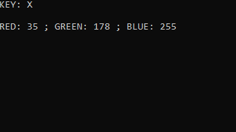

# COLORGRABBER
A simple application that checks and displays the RGB color code of the pixel you are holding the cursor on. To use the application, start it, select the button (must be uppercase) with which you will check color, and press it. 
 

# How to use
1. Compile COLORGRABBER.cpp
2. Run the exe
3. Input the key you want to grab pixel color with
4. Hover cursor at the color you want to grab and press the key selected before
5. The results will be in the console

# Author
Filip Rokita 
www.filiprokita.com